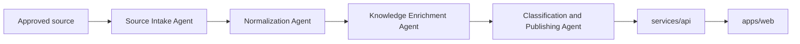

# Product-Facing Agent Roles

## Purpose

This document defines the logical agent roles for the first release of `MoaDev`. These are product responsibilities, not a requirement to deploy one separate service per role.

The goal is to keep `services/agents-runtime` aligned with the product contract while keeping the first implementation small.

## Principles

- Web clients do not call LLMs directly.
- The API serves authenticated product surfaces and processing status.
- `services/agents-runtime` owns asynchronous ingestion and enrichment work.
- Agent roles should map to distinct responsibilities, but they can share one runtime service in the first release.

## Agent Roles

### 1. Source Intake Agent

Responsibilities:

- discover or receive approved article source entries
- fetch article metadata and source content allowed by policy
- record source fetch status and upstream identifiers

Outputs:

- source record
- article metadata
- raw content snapshot or pointer

### 2. Normalization Agent

Responsibilities:

- transform fetched content into normalized article structure
- split content into stable paragraphs or lines for downstream translation
- discard unsupported or noisy markup

Outputs:

- normalized article body
- ordered content segments
- normalization status and warnings

### 3. Knowledge Enrichment Agent

Responsibilities:

- generate line-by-line Korean translation
- generate concise summary
- generate terminology explanations
- generate concept explanations
- propose related concepts

Outputs:

- translation segments
- summary payload
- glossary payload
- concept payload
- related concept payload

### 4. Classification And Publishing Agent

Responsibilities:

- assign category and tags
- validate that the structured output is complete enough to publish
- mark records as `published`, `needs_review`, or `failed`
- expose the final structured shape that API consumers can trust

Outputs:

- category and tags
- publish status
- article detail payload ready for API delivery

## End-To-End Pipeline

## API Path Vs Runtime Path

### Synchronous API Path

- authenticate the user
- serve category, source, and article queries
- expose processing status for incomplete articles
- never perform full article enrichment inline with the user request

### Asynchronous Runtime Path

- source fetch
- content normalization
- translation and explanation generation
- classification
- retry and dead-letter handling

## Structured Output Contract

The runtime must publish a stable article detail record containing:

- article identity and source metadata
- category and tag data
- normalized segments
- segment-aligned Korean translation
- summary
- glossary
- concept explanations
- related concepts
- processing status
- quality notes when content is partial or degraded

## Status Model

Recommended first-release statuses:

- `pending_intake`
- `pending_normalization`
- `pending_enrichment`
- `published`
- `needs_review`
- `failed`

## Retry And Idempotency

- Article processing should key on a stable source identifier such as canonical URL plus source name.
- Reprocessing the same article should update the same logical record instead of creating duplicates.
- Intake, normalization, and enrichment steps should be retryable independently.
- Permanent failures should move the record to `needs_review` or `failed` with an operator-visible reason.

## What This Plan Does Not Do

- It does not require a separate deployable microservice per role in the first release.
- It does not define the exact prompt set or model routing yet.
- It does not approve unrestricted upstream crawling.
