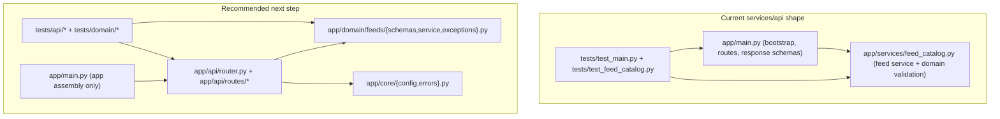

# Architecture

## Repository Shape

`MoaDev` uses a polyglot monorepo with these primary workspaces:

- `apps/web` for the Next.js user interface
- `services/api` for the FastAPI backend
- `services/agents-runtime` for product-facing agent orchestration
- `infra/terraform` for cloud infrastructure definitions
- `ansible` for bootstrap and configuration management inputs
- `ops/env` for externalized mutable platform config samples
- `platform/helm` for chart packaging
- `platform/argocd` for GitOps application definitions
- `platform/monitoring` for dashboards, alerts, and observability overlays

The repository still keeps early bootstrap placeholders under `src/`, `tests/`, `e2e/`, and `scripts/` while the workspace-based layout grows. Migrate incrementally rather than with a broad rewrite.

## High-Level Flow

The intended product path is:

1. `apps/web` renders the developer-facing UI.
2. `services/api` exposes application APIs and domain workflows.
3. `services/agents-runtime` coordinates product-facing agent execution and background automation.
4. `infra/terraform` provisions cloud resources used by the services.
5. `ops/env` and `ansible/group_vars` externalize mutable deployment values so provider-specific topology stays additive and reviewable.
6. `platform/helm` and `platform/argocd` package and promote deployments.
7. `platform/monitoring` captures metrics, logs, traces, dashboards, and alerts for operators.

## Platform Topology

The current platform source of truth is documented in:

- `docs/platform-topology.md`
- `docs/platform-topology.ko.md`
- `docs/assets/diagrams/platform-topology.svg`

These documents intentionally follow the checked-in sample configs on `main`, which currently describe one logical multi-cloud Kubernetes cluster with:

- `platform_topology = multicloud`
- `control_plane_provider = aws`
- `aws_control_plane`, `aws_workers`, and `oci_workers` node groups
- provider-specific overrides kept under `aws_cluster` and `oci_cluster`

Use the dedicated topology docs when reviewing infrastructure boundaries, runtime shape, or how Terraform, Ansible, Kubespray, Helm, and Argo CD hand off responsibility to each other.

## Engineering Boundaries

- Keep route handlers thin and move domain logic into service or domain modules.
- Validate data at system boundaries.
- Prefer additive workspace scaffolding over restructuring existing code without a migration plan.
- Use root `make` commands as the canonical automation entrypoint for contributors and agents.

## FastAPI Structure Review

The current `services/api` layout is intentionally small:

- `app/main.py` owns app bootstrap, route handlers, and response schemas.
- `app/services/feed_catalog.py` owns the first domain service and domain-level validation.
- `tests/` covers endpoint behavior and the feed domain boundary.

Compared with the referenced FastAPI examples:

- `fastapi/full-stack-fastapi-template` uses a layered backend shape with `backend/app/api/` for endpoints plus shared files such as `models.py` and `crud.py`. This repository is not aligned with that layout yet.
- `zhanymkanov/fastapi-best-practices` recommends vertical domain packages with files such as `router.py`, `schemas.py`, `service.py`, `dependencies.py`, and `exceptions.py` per module. The current repo is closer to that direction because domain logic already lives outside the route handler, but it is still more compressed than the recommended module layout.

Current verdict:

- Good for bootstrap: yes
- Aligned with the intent of thin routes and explicit validation: yes
- Fully aligned with either reference structure: no
- Recommended next step: evolve toward small domain packages when the API grows beyond the current single feed boundary

The key design choice for this repository is to keep the first FastAPI slice simple, then split by domain instead of introducing a large horizontal layer map too early.

## FastAPI Evolution Path

Current structure:

```text
services/api/
  app/
    main.py
    services/
      feed_catalog.py
  tests/
    test_main.py
    test_feed_catalog.py
```

Recommended incremental target:

```text
services/api/
  app/
    main.py
    api/
      router.py
      routes/
        health.py
        feeds.py
    domain/
      feeds/
        schemas.py
        service.py
        exceptions.py
    core/
      config.py
      errors.py
  tests/
    api/
    domain/
```

This target keeps `main.py` focused on application assembly, moves HTTP concerns into `api/routes`, and groups business logic by bounded context under `domain/`.

## FastAPI Diagram


