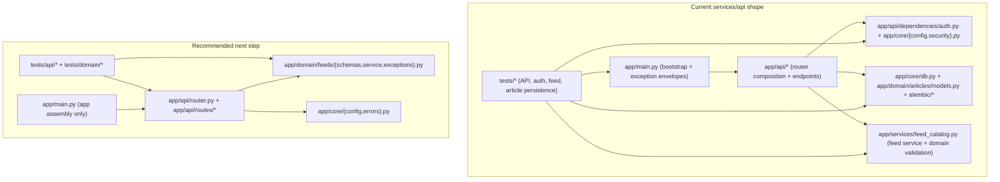

# Architecture

## Repository Shape

`MoaDev` uses a polyglot monorepo with these primary workspaces:

- `apps/web` for the Next.js user interface
- `services/api` for the FastAPI backend
- `services/agents-runtime` for product-facing agent orchestration
- `infra/terraform` for cloud infrastructure definitions
- `ansible` for bootstrap and configuration management inputs
- `ops/env` for externalized mutable platform config samples
- `platform/helm` for chart packaging
- `platform/argocd` for GitOps application definitions
- `platform/monitoring` for dashboards, alerts, and observability overlays

The repository still keeps early bootstrap placeholders under `src/`, `tests/`, `e2e/`, and `scripts/` while the workspace-based layout grows. Migrate incrementally rather than with a broad rewrite.

## High-Level Flow

The intended product path is:

1. `apps/web` renders the authenticated knowledge UI.
2. `services/api` exposes auth-aware application APIs and article query workflows.
3. `services/agents-runtime` coordinates product-facing ingestion, translation, enrichment, and publishing work.
4. `infra/terraform` provisions cloud resources used by the services.
5. `ops/env` and `ansible/group_vars` externalize mutable deployment values so provider-specific topology stays additive and reviewable.
6. `platform/helm` and `platform/argocd` package and promote deployments.
7. `platform/monitoring` captures metrics, logs, traces, dashboards, and alerts for operators.

## Product Planning Sources

The current product and production source-of-truth documents are:

- `docs/prd.md`
- `docs/prd.ko.md`
- `docs/product-plan.md`
- `docs/product-plan.ko.md`
- `docs/agents-product.md`
- `docs/agents-product.ko.md`
- `docs/production-plan.md`
- `docs/production-plan.ko.md`

Use these documents together when reviewing product scope, agent responsibilities, and first-production architecture.

## First-Production Application Flow

The current first-production plan assumes one authenticated AI knowledge workflow:

1. approved sources are ingested asynchronously by `services/agents-runtime`
2. article content is normalized into stable segments
3. translation, summary, glossary, concept explanations, and related concepts are generated off the request path
4. published article records are stored and exposed through `services/api`
5. authenticated users read categorized article lists and detail views in `apps/web`

The first release deliberately keeps AI processing asynchronous and keeps end-user reads on precomputed article records instead of inline model generation.

## First-Production Data And Service Boundaries

- `apps/web` owns authenticated UI and knowledge navigation
- `services/api` owns user-facing read APIs, auth-aware access control, and article/query boundaries
- `services/agents-runtime` owns async ingestion and enrichment
- `PostgreSQL` should remain the first system of record for article metadata, normalized segments, and structured outputs
- `Redis` should back queues, retries, and selective caching
- object storage should hold raw snapshots or larger artifacts when provider policy allows

The detailed first-production design is documented in `docs/production-plan.md` and `docs/production-plan.ko.md`.

## Article Persistence Baseline

Issue `#42` establishes the first shared article persistence baseline inside `services/api` so the API and runtime can share one explicit MVP data contract.

- `services/api/app/core/db.py` owns `DATABASE_URL` resolution plus reusable SQLAlchemy engine and session-factory setup.
- `services/api/app/domain/articles/models.py` owns the first persisted article domain model:
  - `SourceRegistryEntry` for approved source policy and retention metadata
  - `Article` for canonical article identity, category, tags, timestamps, and processing status
  - `ArticleSegment` for ordered normalized source segments plus segment-aligned translation text
  - `ArticleStructuredOutput` for summary, glossary, concept explanations, related concepts, and quality notes
- `services/api/alembic/` owns schema migration history for the baseline relational model.

The MVP deliberately keeps the model narrow:

- source policy stays in the source registry instead of spreading across article records
- normalized segments are first-class rows so runtime and API can agree on stable segment ordering
- richer enrichment payloads stay in JSON fields until product usage proves that further normalization is worth the extra complexity
- the baseline is shaped for `Keek news` first and does not yet generalize to arbitrary multi-domain ingestion

## Authenticated Session Boundary

The current MVP authentication path is intentionally split across the web and API workspaces:

- `apps/web` owns OAuth and session creation through Auth.js.
- Google, Kakao, and Naver are the first supported identity providers, configured through `AUTH_*` environment variables.
- `apps/web/proxy.ts` keeps user-facing application routes behind the session boundary and allows only the login page, Auth.js handlers, and framework assets to bypass it.
- `apps/web` server components and route handlers forward authenticated requests to `services/api` using a signed internal bearer token built from the Auth.js session.
- `services/api` verifies that token through `app/api/dependencies/auth.py`, `app/core/config.py`, and `app/core/security.py` with a shared `MOADEV_INTERNAL_AUTH_SECRET` plus a short max-age check before protected endpoints run.
- `/health` remains public for platform health checks. Product APIs such as `/api/v1/feeds` are protected.

This bridge is an MVP contract for issue `#41`. It keeps the API independent from direct OAuth handling while making the authenticated caller explicit for follow-up article APIs in issue `#44`.

### Auth Boundary Error Rules

- `401` means the caller did not provide a valid authenticated bearer token, or the token was expired or tampered with.
- `403` is reserved for future authorization rules where the caller is authenticated but does not have permission for a specific operation.
- `503` means the API auth bridge itself is misconfigured, such as a missing shared secret.

## Platform Topology

The current platform source of truth is documented in:

- `docs/platform-topology.md`
- `docs/platform-topology.ko.md`
- `docs/assets/diagrams/platform-topology.svg`

These documents intentionally follow the checked-in sample configs on `main`, which currently describe one logical multi-cloud Kubernetes cluster with:

- `platform_topology = multicloud`
- `control_plane_provider = aws`
- `aws_control_plane`, `aws_workers`, and `oci_workers` node groups
- provider-specific overrides kept under `aws_cluster` and `oci_cluster`
- provider-backed Terraform foundations for AWS VPC/subnet/NAT routing, OCI VCN/worker-subnet/NAT routing, and AWS/OCI VM node resources when the env roots run in `create` mode

Use the dedicated topology docs when reviewing infrastructure boundaries, runtime shape, or how Terraform, Ansible, Kubespray, Helm, and Argo CD hand off responsibility to each other.

## Terraform Foundations

The current `infra/terraform` direction now has two layers instead of one:

1. A typed cross-cloud contract that validates shared topology and provider-specific overrides.
2. Infrastructure foundation modules that can either create or reference AWS and OCI network primitives while materializing provider-backed VM node resources from the same Terraform contract.

Current Terraform ownership in this repository is:

- AWS foundation: VPC, control-plane subnets, worker subnets, public load-balancer subnets, internet gateway, NAT gateway, route-table wiring, and self-managed control-plane/worker VM instances
- OCI foundation: VCN, worker route table, NAT gateway, worker subnets, and worker VM instances
- Shared cross-cloud contract: labels, naming prefixes, node-group intent, storage classes, and dev scheduler settings

The current VM foundation contract also makes two operational assumptions explicit:

- AWS and OCI node access is mediated by Terraform-managed security boundaries instead of provider default security rules.
- OCI worker subnet references are modeled as `(subnet_id, availability_domain)` bindings so reference-mode instance placement stays valid.

Current Terraform non-goals in this repository are:

- managed Kubernetes resources
- Helm release boundaries
- Kubespray inventory ownership
- Ansible day-2 operations ownership
- turning the provisioned VM foundations into a joined Kubernetes cluster

See `docs/platform-topology.md` for the example-driven Terraform foundation diagram that matches the checked-in `terraform.tfvars.example` files.

## Engineering Boundaries

- Keep route handlers thin and move domain logic into service or domain modules.
- Validate data at system boundaries.
- Prefer additive workspace scaffolding over restructuring existing code without a migration plan.
- Use root `make` commands as the canonical automation entrypoint for contributors and agents.

## FastAPI Structure Review

The current `services/api` layout is still intentionally small, but it now has clearer HTTP, auth, and persistence boundaries:

- `app/main.py` owns app bootstrap and shared exception-envelope translation.
- `app/api/` owns router composition and versioned endpoint registration.
- `app/api/dependencies/auth.py` owns the authenticated request dependency for protected API routes.
- `app/core/config.py` owns auth- and persistence-related environment configuration.
- `app/core/db.py` owns reusable database engine and session-factory setup.
- `app/core/security.py` owns bearer token signing and verification.
- `app/domain/articles/models.py` owns the first shared persistence model for sources, articles, segments, structured outputs, and processing status.
- `app/services/feed_catalog.py` owns the first domain service and domain-level validation.
- `tests/` covers endpoint behavior, the feed domain boundary, the auth boundary, and article persistence constraints.

Compared with the referenced FastAPI examples:

- `fastapi/full-stack-fastapi-template` uses a layered backend shape with `backend/app/api/` for endpoints plus shared files such as `models.py` and `crud.py`. This repository is not aligned with that layout yet.
- `zhanymkanov/fastapi-best-practices` recommends vertical domain packages with files such as `router.py`, `schemas.py`, `service.py`, `dependencies.py`, and `exceptions.py` per module. The current repo is closer to that direction because domain logic already lives outside the route handler, but it is still more compressed than the recommended module layout.

Current verdict:

- Good for bootstrap: yes
- Aligned with the intent of thin routes and explicit validation: yes
- Fully aligned with either reference structure: no
- Recommended next step: evolve toward small domain packages when the API grows beyond the current single feed boundary

The key design choice for this repository is to keep the first FastAPI slice simple, then split by domain instead of introducing a large horizontal layer map too early.

## FastAPI Evolution Path

Current structure:

```text
services/api/
  alembic.ini
  alembic/
    env.py
    versions/
  app/
    main.py
    api/
      dependencies/
        auth.py
      router.py
      endpoints/
        health.py
      v1/
        router.py
        endpoints/
          feeds.py
    core/
      config.py
      db.py
      security.py
    domain/
      articles/
        models.py
    services/
      feed_catalog.py
  tests/
    test_article_persistence.py
    auth_token_helpers.py
    test_main.py
    test_feed_catalog.py
```

Recommended incremental target:

```text
services/api/
  alembic/
    versions/
  app/
    main.py
    api/
      router.py
      routes/
        health.py
        feeds.py
    domain/
      articles/
        models.py
        repository.py
      feeds/
        schemas.py
        service.py
        exceptions.py
    core/
      config.py
      db.py
      errors.py
  tests/
    api/
    domain/
```

This target keeps `main.py` focused on application assembly, moves HTTP concerns into `api/routes`, and groups business logic by bounded context under `domain/`.

## FastAPI Diagram


