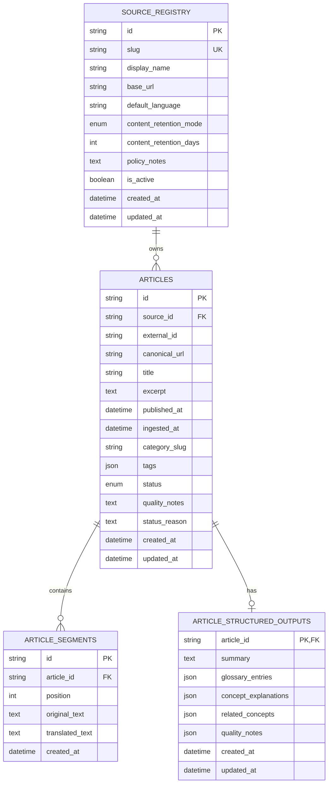

# DB Schema

This document describes the current relational schema used by `services/api` for the article persistence baseline introduced in issue `#42` and consumed by the authenticated article APIs in issue `#44`.

Source of truth:

- `services/api/app/domain/articles/models.py`
- `services/api/alembic/versions/20260421_0001_article_persistence_baseline.py`

## ERD

## Relationship Summary

- `source_registry` is the approved-source registry. One source can own many article records.
- `articles` is the canonical article table used by the API read model.
- `article_segments` stores ordered normalized source segments for an article.
- `article_structured_outputs` stores one optional enrichment payload per article.

## Table Notes

### `source_registry`

- Defines which external sources are allowed.
- Holds retention policy metadata such as `content_retention_mode` and `content_retention_days`.
- Uses `slug` as the main stable human-readable identifier.

### `articles`

- Represents the main article identity and browse metadata.
- Links back to the source via `source_id`.
- Stores category, tags, timestamps, and processing state.
- `external_id` is optional; the API can fall back to the internal UUID when needed.

### `article_segments`

- Stores ordered article body segments via `position`.
- Keeps original text and optional translated text aligned at the segment level.
- Exists as a separate table so ingestion/runtime and API can share one stable segment order.

### `article_structured_outputs`

- Stores the processed article summary and structured learning artifacts.
- Uses `article_id` as both primary key and foreign key, making the relationship effectively one-to-zero-or-one from `articles`.
- JSON columns keep the first MVP schema flexible while the product contract stabilizes.

## Constraints And Indexes

### Keys and uniqueness

- `source_registry.id` is the primary key.
- `source_registry.slug` is unique.
- `articles.id` is the primary key.
- `articles` enforces a unique pair on `(source_id, canonical_url)`.
- `article_segments.id` is the primary key.
- `article_segments` enforces a unique pair on `(article_id, position)`.
- `article_structured_outputs.article_id` is both the primary key and a foreign key to `articles.id`.

### Foreign keys

- `articles.source_id -> source_registry.id`
- `article_segments.article_id -> articles.id`
- `article_structured_outputs.article_id -> articles.id`

All three foreign keys use `ON DELETE CASCADE`.

### Indexes

- `ix_articles_category_slug`
- `ix_articles_published_at`
- `ix_articles_status`

These support the first category browsing and article query flows.

## Enum Values

### `source_retention_mode`

- `metadata_only`
- `normalized_segments`
- `raw_snapshot`

### `article_processing_status`

- `pending_intake`
- `pending_normalization`
- `pending_enrichment`
- `published`
- `needs_review`
- `failed`

## Read Path Usage

The authenticated article read APIs currently use the schema like this:

- `GET /api/v1/categories` aggregates `articles.category_slug`
- `GET /api/v1/articles` reads `articles` joined with `source_registry`
- `GET /api/v1/articles/{article_id}` reads `articles` plus `source_registry`, `article_segments`, and `article_structured_outputs`
- `GET /api/v1/articles/{article_id}/processing-status` reads processing fields from `articles` and whether a related `article_structured_outputs` row exists

## Scope Note

This document covers the current article persistence slice only. It does not yet describe future auth, user, session, runtime job, or admin-oriented tables because those are not part of the current checked-in relational baseline.
