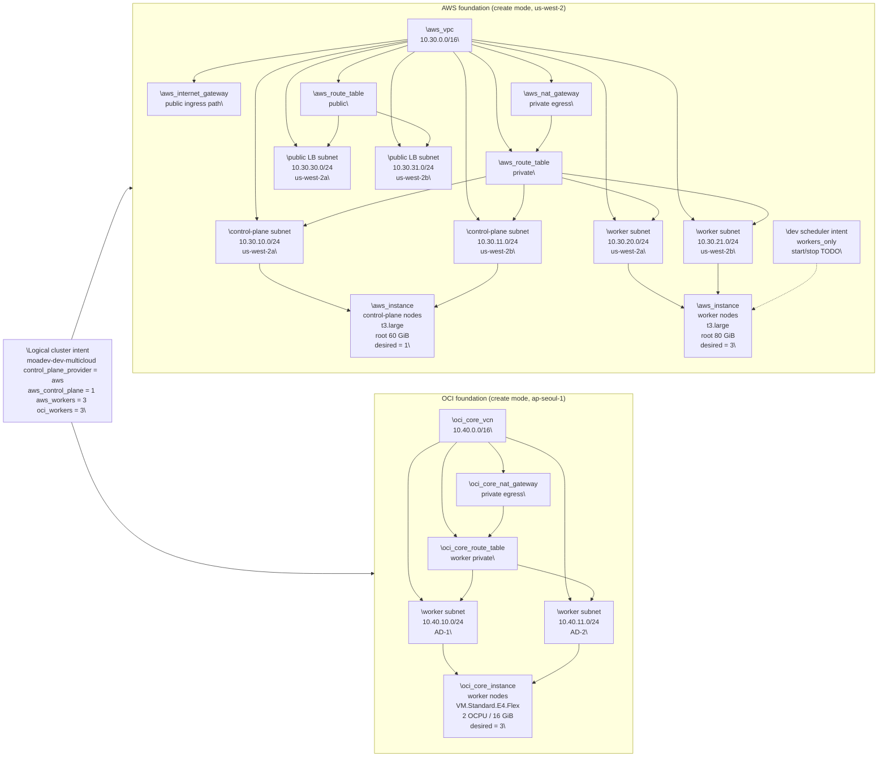

# Platform Topology

This is the easiest entry point for understanding the current platform shape in this repository.

Korean version: [platform-topology.ko.md](platform-topology.ko.md)

This document follows the checked-in sample configuration files under `ops/env`, `ansible/group_vars`, and `infra/terraform/envs/*`. Today those samples describe one logical multi-cloud Kubernetes cluster with an AWS control plane and worker pools split across AWS and OCI.

## One-Minute Summary

- The current sample topology is `multicloud`, not separate AWS and OCI clusters.
- AWS is the control-plane provider and also hosts one worker pool.
- OCI adds a second worker pool to the same logical cluster.
- Shared topology values live in shared config blocks.
- Cloud-specific compute, subnet, and storage details stay in the provider-specific sections.

## Topology In Plain Language

Think about the platform in four layers:

1. Shared intent: one logical cluster, one cluster name, one Kubernetes version, one pod and service CIDR plan.
2. AWS control plane: the cluster control plane is intended to run on self-managed control-plane nodes provisioned on AWS infrastructure by the future Terraform wiring.
3. Worker capacity in both clouds: `aws_workers` and `oci_workers` both join the same cluster as worker node groups.
4. Workload delivery and operations: Helm packages workloads, Argo CD promotes them, and AWS-oriented ingress and observability integrations are currently the default sample direction.

The current sample values make that visible:

- `platform_topology = multicloud`
- `control_plane_provider = aws`
- `aws_control_plane.desired_count = 1`
- `aws_workers.desired_count = 3`
- `oci_workers.desired_count = 3`
- `load_balancer_provider = aws`
- `default_node_group = aws_workers`

## Terraform Foundation View

The current Terraform work under issue `#13` now models the cross-cloud foundation more concretely than the earlier contract-only state.

- Solid boxes below represent provider-backed Terraform resources that are declared today.
- Dashed boxes represent validated Terraform intent that still stops short of a live cloud resource. In the current graph, that is only the optional dev scheduler.
- `dev` and `prod` use the same module graph; the example CIDRs shown below come from `infra/terraform/envs/dev/terraform.tfvars.example`, while `prod` keeps the same shape with `10.31.0.0/16` on AWS and `10.50.0.0/16` on OCI.

Practical reading guide:

- Terraform can now describe the AWS and OCI network envelopes, NAT egress, and VM node resources as real provider resources when `network_mode = "create"`.
- The same env roots still support `reference` mode, so operators can swap in existing VPC/VCN and subnet IDs later without changing the module graph.
- Compute sizing, desired counts, storage classes, and bootstrap template paths remain part of the typed Terraform input contract, while the optional dev scheduler stays as validated intent only.

## Environment vs Provider

These terms solve different problems and should not be merged:

| Term | Meaning | Typical values | Where it shows up |
|------|---------|----------------|-------------------|
| `environment` | Which deployment stage is being targeted | `dev`, `prod` | file path, release process, environment-specific sample values |
| `provider` | Which cloud owns a specific infrastructure primitive | `aws`, `oci` | `control_plane_provider`, node group provider, cloud-specific override blocks |
| `platform_topology` | Whether the overall deployment model is single-cloud or multi-cloud | `single-provider`, `multicloud` | shared topology contract |

Practical rule:

- Use `environment` to choose which copy of values to apply.
- Use `provider` to choose which cloud-specific block supplies compute, network, and storage details.
- Use `platform_topology` to describe the high-level runtime shape.

## Tool Boundaries

| Tool | Owns | Does not own |
|------|------|--------------|
| Terraform | cloud primitives, VPC/VCN wiring, subnets, instances, storage classes, future provider plumbing | app release cadence, Kubernetes package templating |
| Ansible | host-level preparation and mutable operator inputs | cloud resource lifecycle |
| Kubespray | cluster bootstrap and node join flow | app packaging and GitOps promotion |
| Helm | workload packaging and Kubernetes manifests | instance creation or host bootstrap |
| Argo CD | environment promotion and sync orchestration | low-level cluster bring-up |

Short version:

- Terraform creates the places where the cluster can run.
- Ansible and Kubespray turn those hosts into a working cluster.
- Helm defines what gets deployed.
- Argo CD decides when that deployment is promoted into an environment.

## Configuration Handoff

The same logical model is projected into three operator-facing sample surfaces:

| Sample surface | Purpose | Current emphasis |
|----------------|---------|------------------|
| `ops/env/*.env.example` | flat environment-variable view for operators and scripts | fast scanning, shell-friendly values |
| `ansible/group_vars/*.yml.example` | grouped values for bootstrap and config management | readable hierarchy for Ansible/Kubespray |
| `infra/terraform/envs/*/terraform.tfvars.example` | typed Terraform input model | explicit shared topology plus provider-specific override blocks |

Shared groups that stay shared:

- `cluster_topology`
- `domains`
- `images`
- `namespaces`
- `ingress`
- `scheduling`
- `cicd`
- `monitoring`
- `storage`
- `cost_automation`

Provider-specific groups that stay provider-specific:

- `aws_cluster`
- `oci_cluster`

## Current Non-Goals

- This document does not claim the live Terraform modules already implement the full topology.
- This document does not claim the current Terraform modules already turn the provisioned AWS and OCI nodes into a joined Kubernetes cluster.
- This document does not lock final workload placement policy between AWS workers and OCI workers.
- This document does not redefine the repository back to separate AWS and OCI clusters.

## Source Notes

The diagram uses vendor assets vendored into this repository from the official AWS Architecture Icons package and the official Oracle OCI icon toolkit. The AWS control-plane node box intentionally uses generic compute and container imagery so it does not imply a managed Kubernetes product choice.
