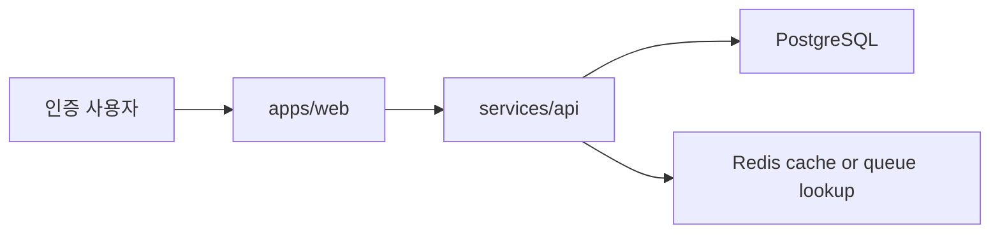
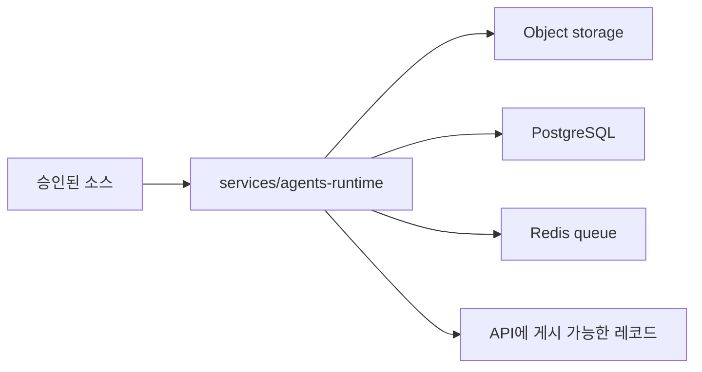

# 첫 프로덕션 계획

## 목적

이 문서는 `MoaDev`의 첫 프로덕션 애플리케이션 및 인프라 구조를 정의한다. 현재 모노레포 구조에 맞는 점진적 설계를 목표로 하며, 이후 서비스 확장을 위한 여지도 남긴다.

기본 참조 문서:

- `docs/prd.md`
- `docs/product-plan.md`
- `docs/agents-product.md`
- `docs/platform-topology.md`

## 첫 프로덕션 아키텍처 목표

다음을 수행할 수 있는 하나의 인증형 AI 지식 웹 제품을 출시한다.

- 승인된 기술 기사 수집
- 기사를 비동기로 처리해 구조화된 한국어 지식 산출물 생성
- 인증된 사용자에게 그 결과를 안정적으로 제공

## 아키텍처 원칙

- 첫 릴리즈는 기존 `apps/web`, `services/api`, `services/agents-runtime` 경계를 유지한다
- 상태 저장 시스템은 무상태 애플리케이션 계층보다 단순하게 가져간다
- 비용이 큰 AI 작업은 사용자 요청 경로 밖으로 밀어낸다
- 초기 서비스 세분화보다 데이터 생명주기 하나를 명확히 하는 쪽을 우선한다
- `main`에 이미 문서화된 self-managed 멀티클라우드 Kubernetes 방향을 그대로 사용한다

## 서비스 경계

| 컴포넌트 | 책임 | 상태 저장 여부 |
|---|---|---|
| `apps/web` | 인증 UI, 카테고리와 기사 화면, 세션 기반 내비게이션 | no |
| `services/api` | 인증/세션 검증, 기사 조회 API, 관리자 안전 경계 | no |
| `services/agents-runtime` | 소스 수집, 정규화, AI 가공, 분류, 게시 작업 | no |
| `PostgreSQL` | 사용자, 소스 레지스트리, 기사 메타데이터, 정규화 세그먼트, 구조화 산출물, 작업 참조 | yes |
| `Redis` | 큐, 재시도, 짧은 처리 조정, 필요 시 캐시 | yes |
| `Object storage` | 원문 스냅샷, 큰 산출물, 백업 친화적 콘텐츠 블롭 | yes |

## 첫 프로덕션 데이터 생명주기

1. 소스 레지스트리가 승인된 제공자와 fetch 정책을 기록한다.
2. 런타임이 기사 메타데이터와 원문 콘텐츠를 수집한다.
3. 정규화 단계가 안정적인 기사 세그먼트를 만든다.
4. AI 가공 단계가 번역, 요약, 용어 설명, 개념 설명, 관련 개념을 생성한다.
5. 분류 단계가 카테고리와 게시 상태를 부여한다.
6. API가 게시된 레코드를 인증된 사용자에게 제공한다.

## 데이터 소유권

### PostgreSQL

다음을 소유해야 한다.

- 소스 레지스트리
- canonical 기사 레코드
- 정규화 텍스트 세그먼트
- 구조화된 AI 가공 JSON 데이터
- 사용자 식별 참조와 권한 상태
- 작업 상태 참조와 실패 이유

### Redis

다음을 소유해야 한다.

- 비동기 작업 큐
- 재시도 카운터와 짧은 락
- 필요 시 자주 조회되는 기사나 카테고리 응답 캐시

### Object Storage

다음을 소유해야 한다.

- 저장 정책이 허용하는 범위의 원문 HTML 또는 소스 스냅샷
- 관계형 저장소에 넣기 큰 AI 산출물
- 백업 대상

## 요청 경로와 백그라운드 경로

### 사용자 요청 경로

원칙:

- 요청 경로는 이미 처리된 기사 데이터만 읽는다
- 최종 사용자 요청 안에서 AI 가공을 수행하지 않는다
- 산출물이 없거나 부분 완료면 제품 상태로 드러내지, 숨겨진 작업으로 처리하지 않는다

### 백그라운드 처리 경로

원칙:

- 수집과 AI 가공은 비동기다
- 재시도는 런타임이 책임진다
- 게시 상태 변경은 사용자에게 노출되기 전에 먼저 영속화되어야 한다

## 인증 경계

- 첫 릴리즈는 모든 지식 콘텐츠에 대해 인증을 요구한다.
- 웹 애플리케이션은 외부 OIDC 호환 인증 제공자 또는 동등한 세션 권한 체계를 사용해야 한다.
- `services/api`는 인증된 사용자 맥락을 검증하고 콘텐츠 접근을 인가해야 한다.
- `services/agents-runtime`은 최종 사용자 인증 플로우를 소유하지 않으며, 내부 작업용 서비스 자격증명만 필요하다.

## 배포 구조

### Kubernetes 워크로드

- `apps/web`, `services/api`, `services/agents-runtime`을 각각 별도 워크로드로 배포한다
- 사용자 대상 서비스와 런타임 워커는 독립적으로 수평 확장할 수 있어야 한다
- 런타임 동시성은 소스 rate limit 과 AI 비용 제어를 위해 조정 가능해야 한다

### 상태 저장 시스템 배치

첫 프로덕션에서는 멀티클라우드 애플리케이션 계층보다 상태 저장 계층을 더 단순하게 유지한다.

- PostgreSQL과 Redis는 클라우드 간 quorum을 늘이지 말고 하나의 주 실패 도메인에 둔다
- 문서화된 control plane 이 AWS에 있으므로 첫 기준선은 AWS 로컬 persistence 를 선호한다
- 운영 성숙도가 오르기 전까지 OCI worker 는 주로 무상태 애플리케이션이나 백그라운드 워크로드에 사용한다

이렇게 하면 멀티클라우드 방향은 유지하면서도 초기에 복잡한 cross-cloud 상태 동기화를 피할 수 있다.

## 관측성 기준선

첫 프로덕션 기준선에는 다음이 포함되어야 한다.

- web 와 API 요청 메트릭
- 런타임 작업 수와 실패 메트릭
- 수집, 정규화, 가공, 게시 단계별 구조화 로그
- 런타임과 API를 관통하는 추적 가능한 job ID
- 큐 적체, 반복 기사 실패, 인증 또는 API 오류 급증에 대한 알림

## 첫 릴리즈에서 의도적으로 미루는 것

- 논리적 에이전트 역할별 독립 배포 마이크로서비스
- 필수 요건으로서의 full-text 또는 vector 검색
- 금융 도메인 수집
- 비회원 공개 브라우징
- 복잡한 cross-cloud 상태 저장 데이터베이스 토폴로지

## 구현 순서

1. PRD, 제품 계획, 에이전트 역할 계획, 프로덕션 계획 문서를 확정한다
2. API와 웹에 인증 기반 기사 읽기 모델을 구현한다
3. `services/agents-runtime`에 비동기 수집 및 가공 파이프라인을 구현한다
4. 큐, 저장소, 관측성을 연결한다
5. 문서화된 self-managed 플랫폼 경로에 배포한다

## 열린 결정 사항

- 최종 인증 제공자
- 제공자별 원문 보관 정책
- PostgreSQL에 구조화 산출물을 전부 저장할지, 큰 payload는 object storage로 분리할지
- MVP에서 기사 검색을 관계형 조회로 유지할지, 조기 전용 검색 계층이 필요한지
