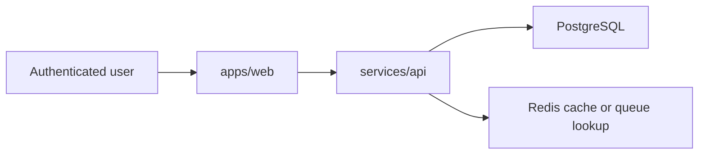
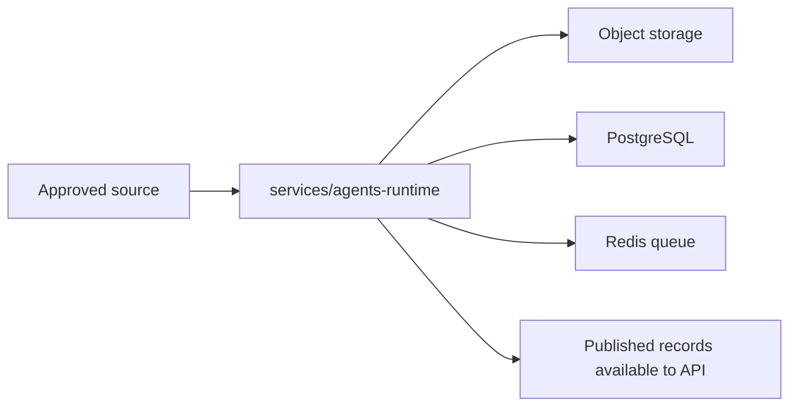

# First-Production Plan

## Purpose

This document defines the first-production application and infrastructure shape for `MoaDev`. It is intentionally incremental and should fit the current monorepo while leaving room for later service expansion.

Primary source-of-truth documents:

- `docs/prd.md`
- `docs/product-plan.md`
- `docs/agents-product.md`
- `docs/platform-topology.md`

## First-Production Architecture Goal

Ship one authenticated AI knowledge web product that can:

- ingest approved technology articles
- process them asynchronously into structured Korean knowledge output
- serve that output reliably to authenticated users

## Architecture Principles

- keep the first release on the existing `apps/web`, `services/api`, and `services/agents-runtime` boundaries
- keep stateful systems simpler than the stateless application layer
- push expensive AI work off the user request path
- prefer one clear data lifecycle over early service fragmentation
- use the documented self-managed multi-cloud Kubernetes direction already checked into `main`

## Service Boundaries

| Component | Responsibility | Stateful |
|---|---|---|
| `apps/web` | authenticated UI, category and article views, session-aware navigation | no |
| `services/api` | auth/session validation, article query APIs, admin-safe orchestration boundaries | no |
| `services/agents-runtime` | source intake, normalization, AI enrichment, classification, publishing jobs | no |
| `PostgreSQL` | users, source registry, article metadata, normalized segments, structured outputs, job references | yes |
| `Redis` | queueing, retries, short-lived processing coordination, caching where needed | yes |
| `Object storage` | raw source snapshots, large artifacts, backup-friendly content blobs | yes |

## First-Production Data Lifecycle

1. Source registry records an approved provider and fetch policy.
2. The runtime ingests article metadata and raw source content.
3. Normalization produces stable article segments.
4. Enrichment generates translation, summary, glossary, concept explanations, and related concepts.
5. Classification assigns category and publication status.
6. The API serves published records to authenticated users.

## Data Ownership

### PostgreSQL

Should own:

- source registry
- canonical article records
- normalized text segments
- structured enrichment JSON payloads
- user identity references and authorization state
- job state references and failure reasons

### Redis

Should own:

- async job queue
- retry counters and short-lived locks
- cache entries for hot article or category responses when needed

### Object Storage

Should own:

- raw HTML or source snapshots when storage policy allows
- larger enrichment artifacts if they outgrow convenient relational storage
- backup export targets

## Request Path And Background Path

### User Request Path

Rules:

- the request path only reads previously processed article data
- article enrichment is never performed inline for end users
- partial or missing output is surfaced as product status, not hidden work

### Background Processing Path

Rules:

- ingestion and enrichment are async
- retries are runtime-owned
- publish state changes are persisted before becoming user-visible

## Authentication Boundary

- The first release requires authenticated access for all knowledge content.
- The web application should rely on an external OIDC-compatible identity provider or equivalent session authority.
- `services/api` should validate authenticated user context and authorize content access.
- `services/agents-runtime` should not own end-user auth flows; it only needs service-to-service credentials for internal jobs.

## Deployment Shape

### Kubernetes Workloads

- deploy `apps/web`, `services/api`, and `services/agents-runtime` as separate workloads
- keep independent horizontal scaling for runtime workers versus user-facing services
- keep runtime concurrency controllable to manage source rate limits and AI cost

### Stateful Placement

For the first production release, keep stateful systems simpler than the multi-cloud application tier:

- run PostgreSQL and Redis in a single primary failure domain instead of stretching quorum across clouds
- prefer AWS-local persistence for the first baseline because the documented control plane already resides on AWS
- use OCI worker capacity primarily for stateless application or background workloads until operational maturity improves

This avoids early cross-cloud state coordination complexity while still fitting the documented multi-cloud cluster direction.

## Observability Baseline

The first production baseline should include:

- request metrics for web and API
- runtime job counters and failure metrics
- structured logs for ingestion, normalization, enrichment, and publishing steps
- traceable job IDs across runtime and API surfaces
- alerts for queue backlog, repeated article failures, and auth or API error spikes

## What The First Release Deliberately Defers

- separate deployable microservices per logical agent role
- full-text or vector search as a hard requirement
- finance-domain ingestion
- public anonymous browsing
- complex cross-cloud stateful database topology

## Implementation Order

1. finalize PRD, product plan, agent-role plan, and production plan
2. implement authenticated article read model in API and web
3. implement async ingestion and enrichment pipeline in `services/agents-runtime`
4. wire queue, storage, and observability
5. deploy on the documented self-managed platform path

## Open Decisions

- exact auth provider
- raw source retention policy per provider
- whether PostgreSQL stores all structured outputs directly or splits large payloads to object storage
- whether article search remains relational in MVP or needs an early dedicated search layer
